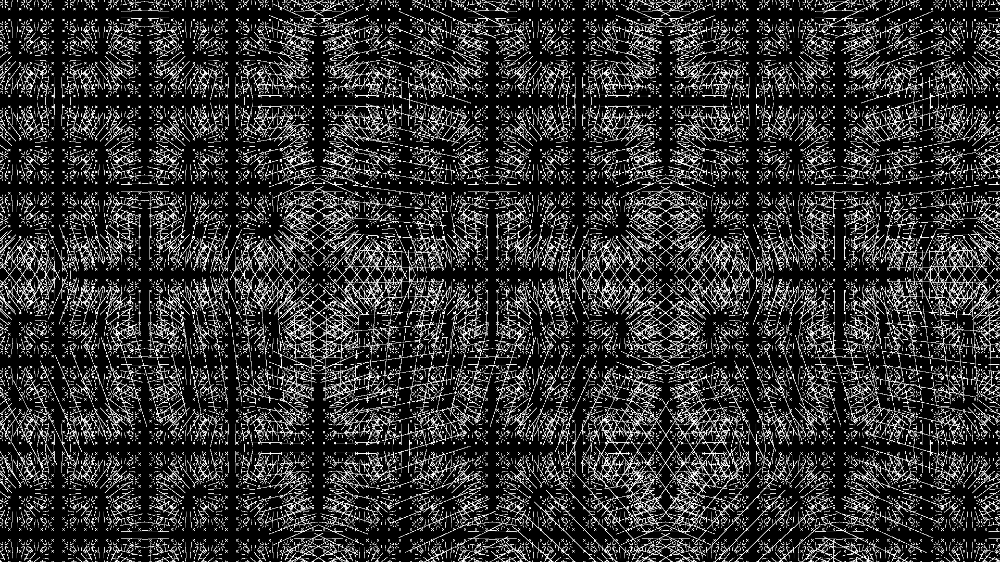
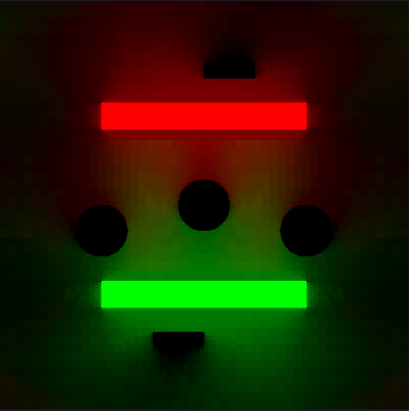

# radiance\_cascades\_2d

2D implementation of Radiance Cascades (invented by [Alexander Sannikov](https://www.linkedin.com/in/alexander-sannikov-9964aa188/))

## To-Do (vaguely ordered by priority and ease of implementation)

- [ ] Interval overlap: how much of the next inverval overlaps with the previous one (percentage?)

- [ ] Free allocated stuff

- [ ] Bilinear filtering

- [ ] Single texture for all of the cascades (they will need to vertically fill the texture)

- [ ] Move cascades calculations on the gpu
    - [ ] cascades creation
    - [ ] cascades merging

- [ ] Calculate cascades for each frame (moving objects)

- [ ] Setup benchmarking environment
    - [ ] Test cases
    - [ ] Logging
    - [ ] Data visualization

## Investigate

- [ ] Different memory layouts
    - [x] for each cascade, probes are adjecent (default)
    - [ ] for each cascade, every direction ray data is adjecent
